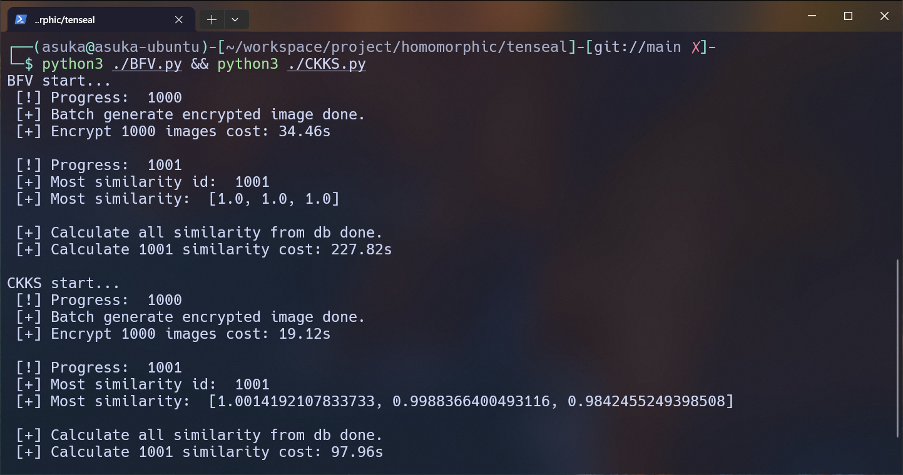

# TenSEAL Image Recognition

## Introduction

This is a simple project that uses TenSEAL for homomorphic encryption and decryption, as well as similarity calculation of images in encrypted form. I encrypt the three channels of 1001 images using the BFV/CKKS scheme with different contexts for each channel. One of the images is encrypted using the user's context. Then, I serialize the BFV/CKKS vector objects and save them in SQLite. After that, I deserialize the serialized objects and calculate the squared cosine similarity numerator and denominator between the BFV/CKKS vector of the target image and these vectors in encrypted form. I return the numerator and denominator of all squared cosine similarities in encrypted form and decrypt them using the user's context. Then, I calculate the squared cosine similarity for each channel separately and find the ID of the most similar image, which is returned to the database. Finally, the database retrieves the encrypted image vector corresponding to the ID and returns it to the user, who can decrypt and reconstruct the image using their private key.

## Platform and Environment

- CPU: Intel 13700K
- GPU: NVIDIA RTX 4060 Ti 8G
- Memory: 32GB
- Operating System: Ubuntu 22.04 LTS
- Python Version: 3.10.12

## Usage

I used anime-faces dataset from huggingface. You can download the dataset from [anime-faces](https://huggingface.co/datasets/huggan/anime-faces/tree/main), unzip `data.zip` and put it in the `image` folder if you like.

Run the following command to compare the time cost of the BFV/CKKS scheme.
```bash
python3 BFV.py && python3 CKKS.py
```

## Results

I use the BFV/CKKS scheme to encrypt the three channels of 1001 images and calculate the cosine similarity between the encrypted image vectors. The results are as follows:

|-|Original Image|BFV Decrypted Image|CKKS Decrypted Image|
|:---:|:---:|:---:|:---:|
|Image||||
|Cosine Similarity|-|[1.0, 1.0, 1.0]|[1.000, 0.999, 0.990]|

> The decrypted image is not exactly the same as the original image because the CKKS scheme use floating-point numbers to represent the encrypted data, which will cause some precision loss. But the decrypted image is still very similar to the original image.

Running time of the BFV/CKKS scheme:
